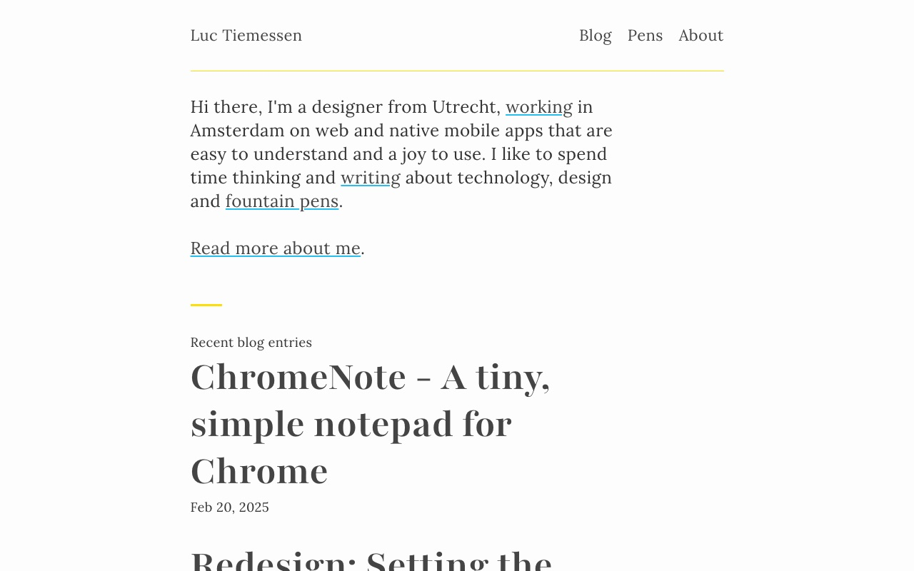
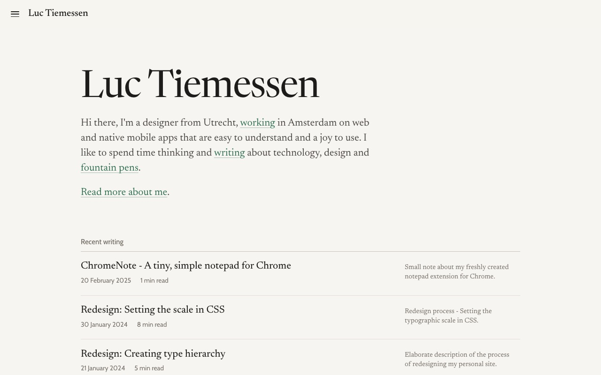
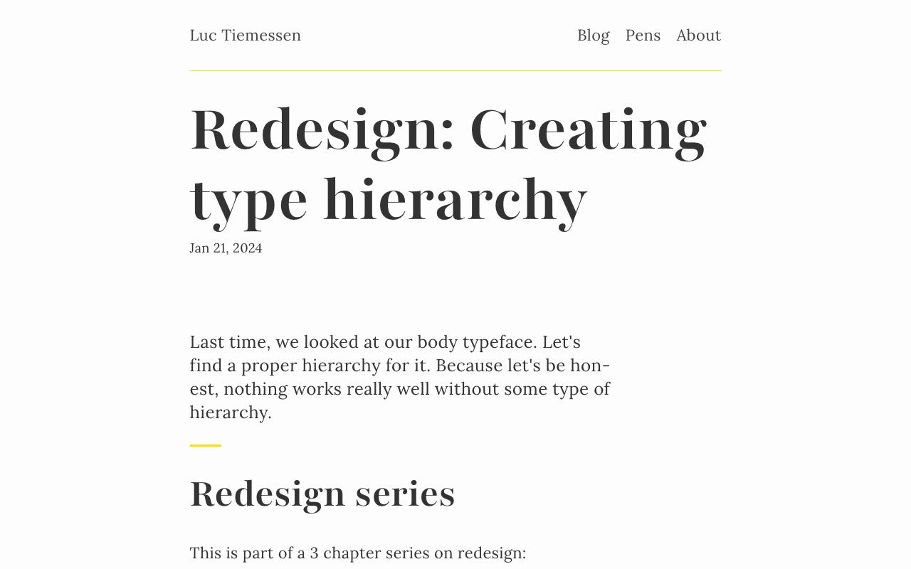
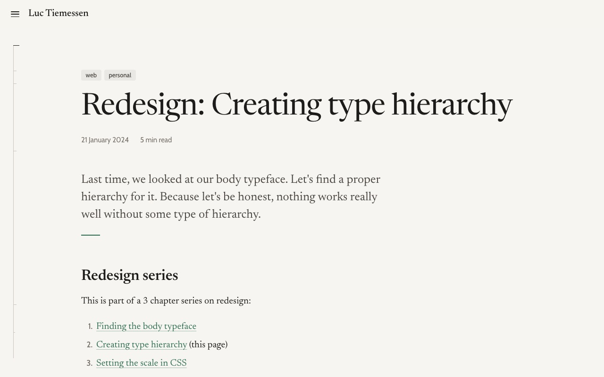
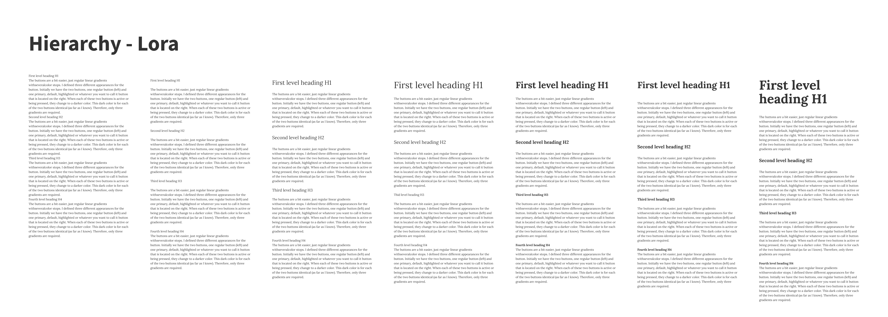

<p class="lead">If you've been here before, you'll notice that everything looks different. New typefaces, a warm paper colour, a single green accent and, most of all, a margin that actually does something. This is how that happened, what I weighed along the way and what I want this design to do.</p>

## Where we came from

In early 2024 I wrote a three-part series about the previous design: [finding the body typeface](/blog/redesign-finding-the-body-typeface/), [creating a type hierarchy](/blog/redesign-creating-type-hierarchy/) and [setting the scale in CSS](/blog/redesign-setting-the-scale-in-css/). The result was online, with small changes, until this spring. Here is the release of 7 October 2025 next to the site as it is today.

<div class="bleed">
<div style="display:grid;grid-template-columns:repeat(auto-fit,minmax(18rem,1fr));gap:1.5rem">
<figure style="margin:0">



<figcaption>October 2025: Lora on white, big bold Playfair titles.</figcaption>
</figure>
<figure style="margin:0">



<figcaption>September 2026: Newsreader on warm paper, descriptions in the margin.</figcaption>
</figure>
</div>
</div>

The 2024 design was built on a few strong ideas. Lora for reading, Playfair for the headings, Source Sans 3 for metadata and Source Code Pro for code. A fluid base size, and everything snapped to a vertical rhythm of `1.5rem` that I could show with a keyboard shortcut. A bright yellow accent and links with a light blue underline. The core of the old stylesheet looked like this:

```css
:root {
  --base-font-family: 'Lora', serif;
  --heading-font-family: 'Playfair', serif;
  --metadata-font-family: 'Source Sans 3', serif;
  --base-font-size: clamp(1.125rem, 1.0373rem + 0.4386vw, 1.375rem);
  --base-line-height: 1.5rem;
  --text-color: #333;
  --background-color: #fdfdfd;
  --accent-color: hsla(52, 100%, 51%, 1);
  --information-color: hsl(195, 88%, 55%);
}
```

The layout was a grid of six columns, at most `62rem` wide. The text sat in columns two to five, and anything wider, like an image, could span all six. That worked, but it had a price: every article had to be wrapped in a `<div class="span2-4">`, and every wider element meant closing that div, opening a `bleed` and opening a new `span2-4` after it. My markdown was full of layout.

<div class="bleed">
<div style="display:grid;grid-template-columns:repeat(auto-fit,minmax(18rem,1fr));gap:1.5rem">
<figure style="margin:0">



<figcaption>An article in 2025. The title is the loudest thing on the page.</figcaption>
</figure>
<figure style="margin:0">



<figcaption>The same article now, with tags, reading time and the rail on the left.</figcaption>
</figure>
</div>
</div>

This spring I took a detour. Based on a design I generated with Google Stitch, the site got Newsreader with Inter, a floating glass navigation pill and an editorial list with teal tags. It was live for a few months, but it was built on top of the old stylesheet, which grew from 676 to 1,414 lines along the way. Its write-up never left draft. Time for a proper reset.

## Starting with a styleguide

This time I started with the styleguide instead of the site. I worked it out in a conversation with Claude: one page that shows every element of the site, from colours and typefaces to footnotes and the menu, each with a short explanation next to it. The [styleguide](/styleguide/) is written in Dutch, and its CSS carries the working title *Kanttekeningen*: Dutch for notes in the margin.[^kanttekeningen] That name turned out to describe the whole design.

The styleguide is built on a handful of rules.

1. **Reading comes first.** One column of about seventy characters, generous line spacing, and nothing that competes with the text.
2. **Two typefaces, two jobs.** A serif for everything you read, a sans-serif for everything you use.
3. **One paper, three inks, one accent.** Colour is reserved for what you can click or what lights up.
4. **The margin is part of the page.** Footnotes, captions and descriptions live next to the text, not below it.
5. **Dark mode is not an afterthought.** Every colour has a dark counterpart, chosen by hand.

Once the styleguide was done, I gave the page and its CSS to Claude Code and had it rebuild the whole site around it: every page, every layout, and all the markdown. The rest of this article is about what that involved.

## Typography

Newsreader, by Production Type, is now the typeface for everything you read: body text, headings and notes. It's a variable font with an optical size axis, so small text automatically gets a little sturdier and large text a little finer. Cabin, a humanist sans-serif in the tradition of Johnston and Gill, is for everything you use: the menu, dates, tags, tables and captions. Code uses whatever monospace your system has.

<figure>
<div style="display:grid;grid-template-columns:repeat(auto-fit,minmax(13rem,1fr));gap:1.25rem">
<div style="border-top:1px solid var(--rule);padding-top:.9rem"><div style="font:400 2rem/1.1 var(--font-serif);letter-spacing:.02em">Racgt iI1l</div><div style="font:400 .8125rem/1.4 var(--font-sans);color:var(--ink-3);margin-top:.5rem">Newsreader: reading</div></div>
<div style="border-top:1px solid var(--rule);padding-top:.9rem"><div style="font:400 2rem/1.1 var(--font-sans);letter-spacing:.02em">Racgt iI1l</div><div style="font:400 .8125rem/1.4 var(--font-sans);color:var(--ink-3);margin-top:.5rem">Cabin: using</div></div>
</div>
<figcaption>My old letterform tests from 2024, <em>Racgt</em> and <em>iI1l</em>, in the new typefaces.</figcaption>
</figure>

The heading scale follows one simple idea: the bigger the heading, the lighter the weight. A large title in a regular weight already has plenty of presence; a small heading needs more weight to stand out. That's the opposite of the old design, where the page title was the heaviest thing on the page.

<figure>
<div style="font-family:var(--font-serif);line-height:1.15">
<div style="font-size:2.1em;font-weight:450;letter-spacing:-.015em">Heading 1 · 450</div>
<div style="font-size:1.6em;font-weight:560;margin-top:.35em">Heading 2 · 560</div>
<div style="font-size:1.22em;font-weight:600;margin-top:.4em">Heading 3 · 600</div>
<div style="font-size:1em;font-weight:650;margin-top:.45em">Heading 4 · 650</div>
</div>
<figcaption>Four heading levels. Size goes down, weight goes up.</figcaption>
</figure>

Both typefaces are now served from this site through Fontsource instead of Google Fonts.[^fontsource] In January 2024 I put "Check if Google Fonts calls can be minimized" on my to-do list.[^todo] They're now zero.

## Colour

The old site was dark grey text on white, with yellow and light blue as accents. The new palette is warmer and quieter: one paper colour, three shades of ink and a single green. The green is reserved for links, footnote numbers and whatever lights up when you hover over it.

<figure>
<div style="display:grid;grid-template-columns:repeat(auto-fit,minmax(6.5rem,1fr));gap:.75rem;font:400 .75rem/1.35 var(--font-sans);color:var(--ink-3)">
<div><div style="height:2.75rem;border-radius:5px;background:var(--paper);box-shadow:inset 0 0 0 1px var(--rule-strong)"></div>Paper</div>
<div><div style="height:2.75rem;border-radius:5px;background:var(--ink)"></div>Ink</div>
<div><div style="height:2.75rem;border-radius:5px;background:var(--ink-2)"></div>Ink 2</div>
<div><div style="height:2.75rem;border-radius:5px;background:var(--ink-3)"></div>Ink 3</div>
<div><div style="height:2.75rem;border-radius:5px;background:var(--rule)"></div>Rule</div>
<div><div style="height:2.75rem;border-radius:5px;background:var(--accent)"></div>Accent</div>
<div><div style="height:2.75rem;border-radius:5px;background:var(--accent-tint)"></div>Accent tint</div>
</div>
<figcaption>The palette, live from the stylesheet. Switch your system to dark mode and it changes along with the page.</figcaption>
</figure>

For comparison, here is the 2025 palette, frozen in time:

<figure>
<div style="display:grid;grid-template-columns:repeat(auto-fit,minmax(6.5rem,1fr));gap:.75rem;padding:1rem;border-radius:6px;background:#fdfdfd;font:400 .75rem/1.35 system-ui,sans-serif;color:#555">
<div><div style="height:2.75rem;border-radius:5px;background:#fdfdfd;box-shadow:inset 0 0 0 1px #ddd"></div>Background</div>
<div><div style="height:2.75rem;border-radius:5px;background:#333"></div>Text</div>
<div><div style="height:2.75rem;border-radius:5px;background:hsl(52,100%,51%)"></div>Accent</div>
<div><div style="height:2.75rem;border-radius:5px;background:hsl(195,88%,55%)"></div>Links</div>
<div><div style="height:2.75rem;border-radius:5px;background:hsl(40,2%,94%)"></div>Inset</div>
</div>
<figcaption>The 2025 palette, with fixed colours so it looks the same in both modes.</figcaption>
</figure>

All colours are defined once, as custom properties in a small `tokens.css`, with a separate block for dark mode:

```css
:root {
  --paper: #f7f5f1;
  --ink: #1d1c1a;
  --ink-3: #736e65; /* metadata, notes, captions */
  --accent: #2f6f4f;
  --measure: 40rem; /* ± 70 characters per line */
}

@media (prefers-color-scheme: dark) {
  :root:not([data-theme='light']) {
    --paper: #1c1d1b;
    --ink: #e9e6e0;
    --ink-3: #969186;
    --accent: #8bc6a1;
  }
}
```

The lightest ink, used for dates and notes, still has a contrast of 4.65:1 against the paper, just above the 4.5:1 that WCAG asks for small text. I did try a lighter paper for light mode, with the raised surfaces a shade darker instead of lighter. In the end I liked it as it was.

## The margin

This is the biggest change. On a wide screen, the page now has a column for notes to the right of the text. The text column itself is fixed at `40rem`, about seventy characters per line.

<div class="bleed">
<figure style="margin:0">
<div style="display:grid;grid-template-columns:40fr 3fr 15.5fr;font:400 .75rem/1.3 var(--font-sans);text-align:center;min-height:5.5rem">
<div style="display:grid;place-items:center;background:var(--accent-tint);color:var(--ink);border-radius:4px 0 0 4px">text · 40rem</div>
<div style="display:grid;place-items:center;color:var(--ink-3)">gap</div>
<div style="display:grid;place-items:center;border:1px dashed var(--rule-strong);color:var(--ink-3);border-radius:0 4px 4px 0">notes · 15.5rem</div>
</div>
<figcaption>The grid from 1120 pixels up: a text column, a small gap and a column for notes. Anything with the class <code>bleed</code> spans all three.</figcaption>
</figure>
</div>

In CSS that's a grid with named lines, so an element only needs to say which area it belongs to:

```css
.page-grid {
  display: grid;
  grid-template-columns:
    [full-start] minmax(var(--gutter), 1fr)
    [text-start] minmax(0, var(--measure))
    [text-end] var(--note-gap)
    [notes-start] var(--note-w)
    [notes-end] minmax(var(--gutter), 1fr)
    [full-end];
}
```

Three things live in that margin.

**Footnotes.** I write them as ordinary markdown footnotes, and a small script copies each one into the margin, on the same baseline as the line with its number. Hover over the number or the note, and both light up.[^sidenote] Without JavaScript, or on a narrow screen, they simply stay at the bottom of the page. Between those two sizes, a small window appears when you point at the number with a mouse. Notes that would collide with a wide image move down below it.

**Captions.** An image in the text column gets its caption in the margin, aligned with the bottom of the image. In a `bleed`, where there's no margin left, the caption moves below the image.

**Descriptions.** On the [blog](/blog/) and the home page, the description of each post sits in the margin, and lights up when you point at the row.

Sidenotes are an old idea, best known from Edward Tufte's books and brought to the web by Tufte CSS.[^tufte] What I like about them is that a side remark stays a side remark. You can read it without losing your place, or skip it without missing anything.

## The rail on the left

The left margin got a job too. A thin vertical line fills up as you read, with a small tick for every heading, placed at the same relative height as that section in the article. Move your mouse to the left edge of the screen, and the headings appear next to their ticks. It works with the keyboard as well, and on a tablet you tap the rail. On a phone there's no room for it, so the contents move into the menu and a thin green progress bar runs under the header instead.

The header itself is translucent and blurs whatever scrolls underneath it. It slides away when you scroll down and comes back as soon as you scroll up.

## Under the hood

Rebuilding the site around the styleguide meant a lot of choices that you won't see, but that I'll be glad of the next time I touch the code.

### Markdown is plain again

Every `span2-4` div is gone from every article. The layout lives in the templates, where it belongs. An article that used to start like this:

```html
<div class="span2-4">
  <p class="lead">Last time, we looked at our body typeface…</p>

## Redesign series
…
</div>

<div class="bleed">



</div>
<div class="span2-4">
…
```

now just starts with its lead and its first heading. The only layout class left in my markdown is `bleed`, for the few things that deserve to be wider. Cleaning this up also surfaced a missing `</div>` that had quietly made half of one draft run into the margin.

### CSS by concern, in layers

The old site had one big `main.css`. The new CSS is split by what it does, not by page:

```text
src/styles/
├── tokens.css      colours, typefaces and sizes
├── base.css        reset, links, focus, reduced motion
├── layout.css      header, menu, footer, page grid, rail
├── article.css     the text itself, code, tables, notes
├── archive.css     the lists on home and /blog/
└── styleguide.css  only for /styleguide/
```

All of them load together, once, as a single stylesheet of about 28 kB that the browser can cache for the whole site. I'll be honest: there's more CSS than in 2025. But the site also does more (notes in the margin, the rail, the menu, a real dark mode, tables that work on a phone), and each file now has one job.

To keep the article styles from fighting with components, the CSS uses cascade layers.[^layers] The running text sits in a layer called `prose`, and anything outside a layer always wins from it. That means I can drop a component like a list of tags into the middle of an article, and the article's list styles won't touch it:

```css
@layer base, prose;

@layer prose {
  .prose ul { padding-left: 1.4em; }
}

/* Not in a layer, so it always wins from .prose ul */
.post-tags { display: flex; padding: 0; }
```

This is also why one piece of the old build had to go. The site ran every stylesheet through PostCSS Preset Env at its most experimental setting, which rewrote those layers into specificity hacks like this:

```css
.prose:not(#\#) a { color: blue }
.post-tags:not(#\#):not(#\#) { display: flex }
```

That technically keeps the order intact, but it bloats the CSS and makes every later override harder. Every browser I care about supports layers natively, so the preset is gone.

### Code that follows the theme

Code blocks used to be coloured with twenty hand-maintained custom properties. They now use two ready-made themes, GitHub Light and GitHub Dark, and switch with the rest of the page:

```js
// astro.config.mjs
markdown: {
  shikiConfig: {
    themes: { light: 'github-light', dark: 'github-dark' },
    defaultColor: false,
  },
},
```

### Astro 7

With the new design in place, I also upgraded from Astro 5 to Astro 7. The biggest change was Astro's new markdown processor, which made one of my old plugins unnecessary. To be sure nothing else changed, I built the site before and after the upgrade and compared every page: the structure, the links, the text, the RSS feed and the sitemap. They were identical, apart from some whitespace between elements that you can't see.

## What I'm aiming for

Looking at the old and new screenshots side by side, the biggest difference isn't the typeface or the colour. The old site was loud: big bold titles, a bright yellow accent, everything at the same level. The new one tries to be quiet, so that the text can do the talking. These are the goals I want every future change to be measured against:

- **Reading first.** One comfortable column, typography that doesn't draw attention to itself, and nothing moving unless you ask for it.
- **Side material at arm's length.** Notes, captions and descriptions are close to the text, but never in the way.
- **Colour means something.** If it's green, you can click it or it's responding to you.
- **Content stays content.** Articles are plain markdown; layout lives in the templates.
- **Easy to change.** The look of the whole site comes from one small file of tokens.
- **Accessible by default.** Readable contrast in both modes, visible focus, everything reachable with a keyboard, and no animation for people who asked their system for less motion.

The [styleguide](/styleguide/) is now the single reference for all of this. When something new needs to be designed, it goes there first.

There's still work to do. Images on this site are copied as they are rather than optimised, and the drafts about my fountain pens deserve some attention now that they have a margin to put their footnotes in. But for the first time in a while, I don't feel like tinkering with the design. I feel like writing.

[^kanttekeningen]: In Dutch, *kanttekeningen* also means critical remarks or reservations. For a blog, that seems fitting too.
[^fontsource]: [Fontsource](https://fontsource.org/) packages open-source fonts so you can host them yourself.
[^todo]: In [New year, New site](/blog/new-year-new-site/), under "Some todos".
[^sidenote]: Like this one. On a narrow screen you'll find it at the bottom of the page instead.
[^tufte]: [Tufte CSS](https://edwardtufte.github.io/tufte-css/) by Dave Liepmann, based on the books of Edward Tufte.
[^layers]: [@layer](https://developer.mozilla.org/en-US/docs/Web/CSS/@layer) on MDN.
