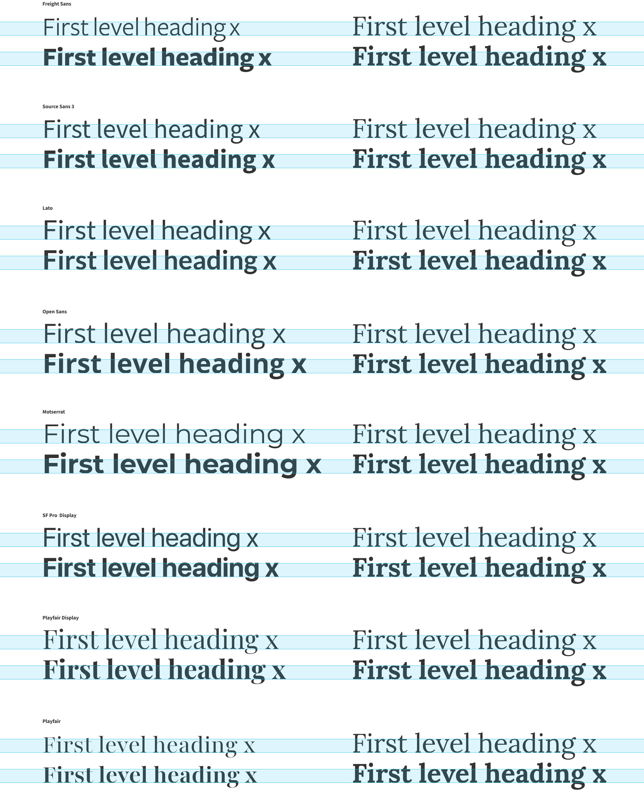
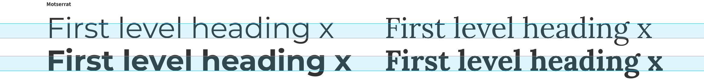
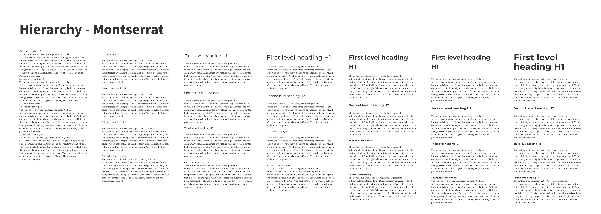
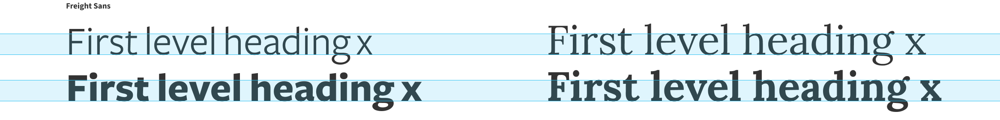
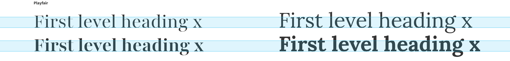

  
Last time, we looked at our body typeface. Let's find a proper hierarchy for it. Because let's be honest, nothing works really well without some type of hierarchy.

## Redesign series
This is part of a 3 chapter series on redesign:
1. [Finding the body typeface](/blog/redesign-finding-the-body-typeface/ "Finding the body copy typeface" )
2. [Creating type hierarchy](/blog/redesign-creating-type-hierarchy/ "Creating type hierarchy") (this page)
3. Setting the scale in CSS

## Hierarchy
There are quite a lot of variables to play with for the hierarchy: size, weight, color, spacing, and the typeface. Although I knew I eventually wanted to have a different typeface for the headings, I still liked to start with experimenting with some of the other variables using the body typeface first and see how far we could come.

Four levels would be enough for me, and I want the fourth level to be close to my main text without any bottom margin so it blends nicely into the main text. I usually only use a bigger weight to let it stand out just a bit. For the other levels, I want them to stand on their own and have enough visual differences that one would be able to identify the level without the context of the other levels being present.

On the left, I started with no spacing, nothing, just the same font as my main font. Obviously, that didn't work too well, but I’ll start from that. After that, I added some space, since I don’t think we can live without it. Like I mentioned above, the bottom margin of the h4 is deliberately kept at 0, which seems fine for now. But the spacing alone is not enough; they are not standing out from each other. So I bumped up the size with increments of 6, but for the h1, I really wanted to make a big jump and increased that one by 10 up from the h2. I liked what it did, but for my liking, it was a bit too simple, boring maybe. So I gave it another bump up to an arbitrary double size of the h2. With the fourth iteration, I felt we were getting somewhere.

Then I added additional weight to the headings to see what it did. This worked properly for the h4, standing out just a tad more. The h2 and h3 were also okay for now, but the h1 was not really what I was aiming for. So I added some additional bottom margin to separate it a bit more from the content. This works, but it also opened up another thing to try, just another bump in size to see what it would do. I ended up at a whopping 90px. I was happy with the direction of this but I found that Lora was a bit too bulky at this size. Which is fine, it gave me some direction on what typefaces I wanted to explore.

## Comparing x-height
My initial goal was to use a sans typeface for the headings. Having a sans typeface for headings helps to clearly distinguish the hierarchy and especially in heavier weights, they can be elegant and prominent at the same time. I usually start by finding typefaces that have a similar x-height. Although I knew upfront that a similar x-height might be a bit too much depending on the other characteristics of the typeface.

With Lora on the right column, I’ve taken its x-height and put some alternatives in the left column.

I could directly see that Freight and Playfair had a lower x-height and Montserrat’s and SF Pro’s x-height were quite a bit taller.

So Montserrat would give me a big and spacious heading with a really big x-height. Probably a bit too much. But let’s find out.

Well, this was a bit expected, big and bold but it has a bit too much air around it, especially in the bigger size, and the h4 also now is a bit too prominent for my liking. Let’s have a look at the ones with the smaller x-heights.

I really love the heavy Freight Sans face, maybe not the elegance I was initially looking for, but it is bold and brave and has its nice angled edges. I added Playfair to the mix since it was one of my considerations for the body face as well. Even though it is a serif face, I somehow wanted to see what it could do for my headings.

I fell in love with Freight Sans from this moment on. It is bold and brave and I just love the bulkiness for the big sizes without losing legibility. I went for it and continued to set the type in Freight. Although Playfair was also really nice and elegant, Freight Sans felt just right and also… I really wanted sans-serif headings.

## But...
Yes, but… as you might have seen, at some point during the development of this site, I changed it to Playfair. This was because of two things. Firstly, I found out that it was not supported by Google Fonts and I didn’t want to embed two types through different methods. But the more important reason was; with longer titles (spanning over more than two lines) Freight Sans became a bit too much for my liking. Too much typographic color even in smaller sizes. So, when I almost finished the development and saw my own content set in Freight Sans, it started to itch a bit. And I started to ask some questions:

<em>Is this too bulky? There is a lot of black in these headings now, isn’t there? Hmm, orphans somehow really feel out of place, right?</em>. 

I stubbornly ignored these signals and continued with developing the site and then all of a sudden, I thought… Why not dig up Playfair again to see what it does. And once I did, I was instantly in love. This is what I wanted, this is the elegance I liked to see, this just felt right. Although it is not as brave as Freight, it makes up for it in elegance.

### Lessons learned

And just like that, I learned that prepping like mad in Figma is nice, but when you really see the typefaces applied to your content, you will find out soon enough that it might just turn out a bit differently.

Even though I think exploring and comparing types in Figma (or any other tool) is useful and even more efficient early on in the process, I think I could have benefitted from earlier stepping towards actual code with actual content.

In the next section, I’ll discuss what I did to set the scale in CSS.

