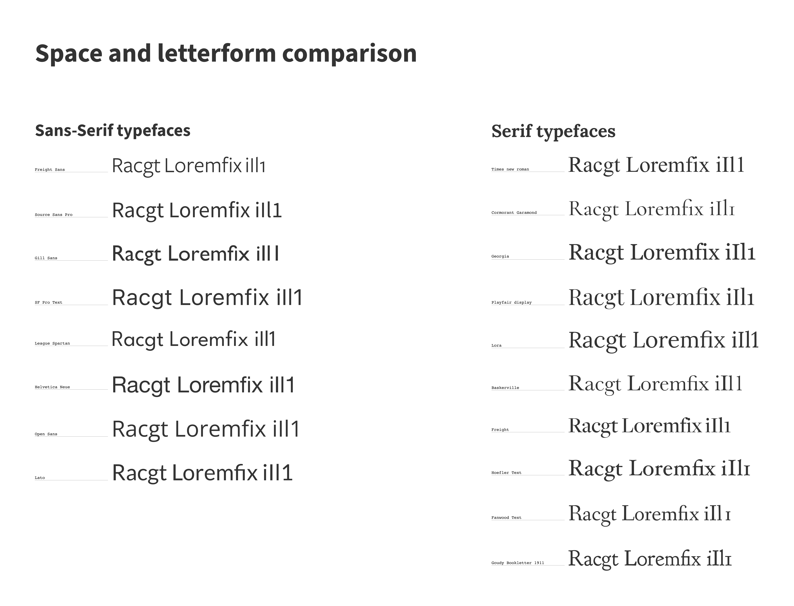
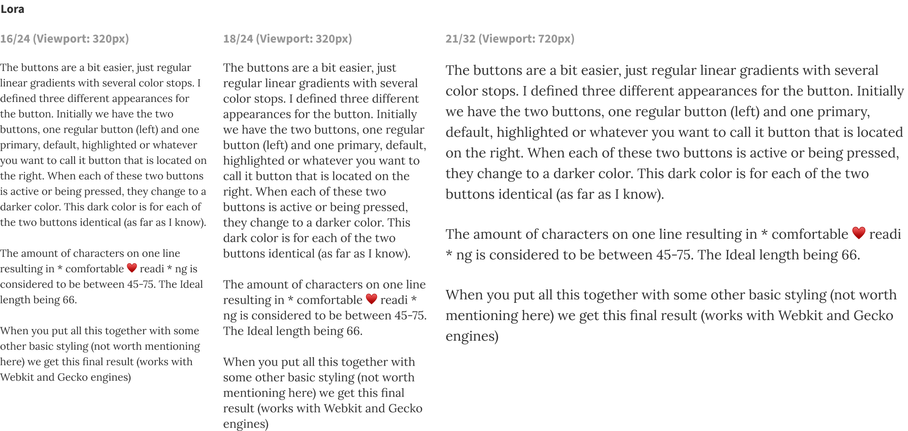
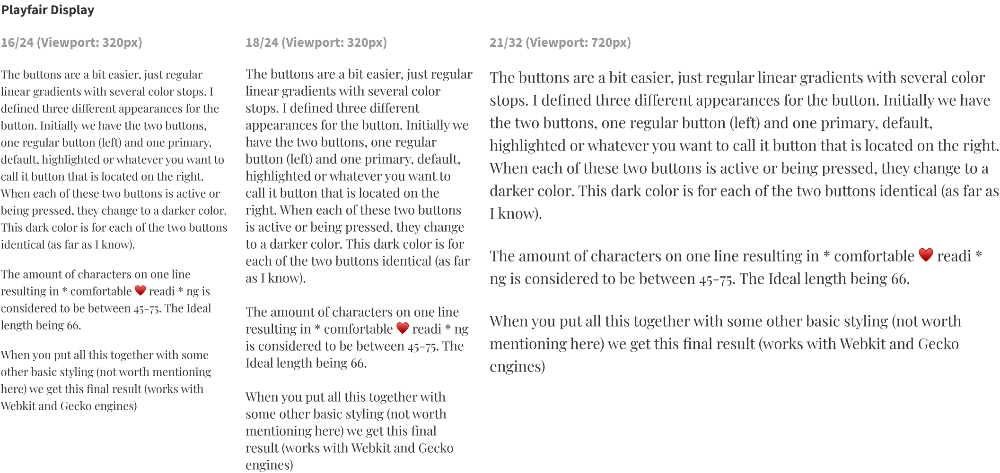
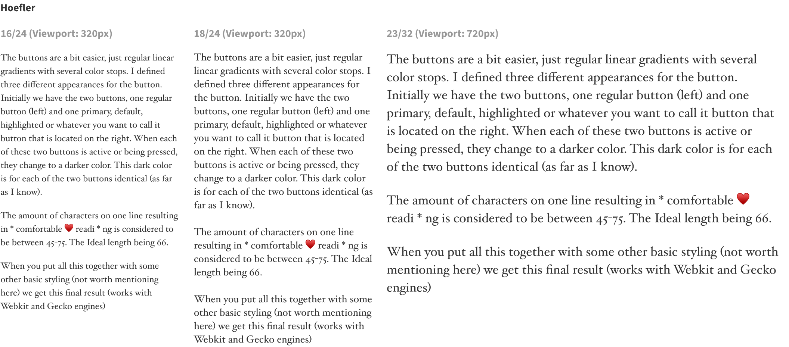

  
Looking at my new site, I'm happy with the result (at the moment) but it took some time. Too much time! You would expect a designer to be able to make design choices a bit more easily when it's their daily job but still, when it comes to my own site, it is a lot harder to compromise. <em>Is it good enough? Can I show this to my peers? How will I feel about this in a few weeks?</em> Regardless of the slow process, this was mine... 

## Redesign series
I'll be dividing this description up into 3 chapters:
1. Finding the body copy typeface
2. Chosing the right typeface pairing
3. Creating the typographic hierarchy

  ## Why start with the typeface?

  I started with chosing the font for the body copy. It feels right to start with the one thing that is used the most and build from there. Since I'm not a visual designer, I wanted my site to let the text be the star by having elegant typographic elements, so I thought I should start there and build from there.

  I was looking for a typeface that would give me an elegant atmosphere that has some space in the letterforms and reads easily. My initial thoughts were to only consider serif typefaces but I wanted to explore soms sans-serifs as well. 

### Exploring options
  When chosing typefaces, I like to look at specific letterforms. I'm often judging the lower case g (I love a good double-story g) and upper case R and also the lowercase a, s and c to judge if there is some space around the letterforms. Finally the t for me is a lettershape that needed to be elegant. <em>Racgt</em> is the lettersequence I use to do an initial assesment. Next I just use <em>Loremfix</em> for the capital L and the potential fi ligature. Additionally I use the <em>iI1l</em> characters to scan for character imposter syndrome. I really want distinct letterforms for the lowercase i, capital i, number one and lowercase l. Since they are so often alike, I want to chose a typeface that can display these distinctions properly. 

 
  
 

It is obvious that almost all of the selected sans-serif typefaces are not passing the iI1l test. Apart from Source Sans Pro. I kept that in mind but quickly discarded the sans-serif typefaces for the body copy. On to the serifs. 

I'm always blown away by the difference in fonts with the same sizes (x-height and tracing). It is quite apparent in the serif column. Lora takes up so much more space than Freight does. And Garamond - however really elegant and slender - it almost feels too fragile for long reads.

I liked the straight stems of Freight and thought I could get away with the tightness of it when I would add some letter spacing but it somehow did not feel right with its very light cross bars especially in smaller sizes. I paired a few others that were close to the one I liked instantly, Lora.

With this, for me it was really clear. I like the legibility of Georgia but I always feel it is a little bulky. Hoefler holds a similar weight as Georgia and compared to Lora, I thought that Playfair was a bit too tall (although I really, really love the fi ligature and the two story g). 
For me, Lora strikes a really great balance for legibility, elegance but it's also a bit quirky with its curved stems which makes it a bit more playful while delivering on legibility also on smaller sizes. 

### Sanity check

To double check the choices I made, I put all the typefaces in different sized in different viewports to see how the text behaves in different contexts. What I'm looking for here is to see if the considerations that I had while looking at the letterforms are still usable and also if my choices are also not hurting the legibility. One of the smallest viewport sizes is 320px so it is wise to check this (and determine the minimum size there) and I'm using the 45-75 character rule to determine a (starting point for a) maximum width of the page. In my case for Lora this was around 720px at 21px (which was the size I like to have as a maximum). 

I like what I see from Lora. Very good readability, where Playfair feels a bit too tall and upright for me. I was surprised to see so little difference between Lora and Hoefler in terms of legibility even though they have very distinct shapes. I love some of the letterforms of Hoefler (the W, ohw my...) but the lush feel I get from Lora still gives it the upper hand for me. I'll stick with Lora and move on to the next phase. Finding a proper typeface for the headings to pair it with. 

