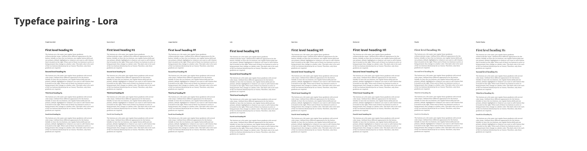

  
Looking at my new site, I'm happy with the result (at the moment) but it took some time. Too much time! You would expect a designer to be able to make design choices a bit more easily when it's their daily job but still, when it comes to my own site, it is a lot harder to compromise. <em>Is it good enough? Can I show this to my peers? How will I feel about this in a few weeks?</em> Regardless of the slow process, this was mine... 

  ## Picking a font for the body copy

  I started with chosing the font for the body copy. It feels right to start with the one thing that is used the most and build from there. Since I'm not a visual designer, I wanted my site to let the text be the star by having elegant typographic elements, so I thought I should start there and build from there.

  I was looking for a typeface that would give me an elegant atmosphere that has some space in the letterforms and reads easily. My initial thoughts were to only consider serif typefaces but I wanted to explore soms sans-serifs as well. 

  When chosing typefaces, I like to look at specific letterforms. I'm often judging the lower case g (I love a good double-story g) and upper case R and also the lowercase a, s and c to judge if there is some space around the letterforms. Finally the t for me is a lettershape that needed to be elegant. Racgt is the lettersecuence I use to do an initial assesment. 

  <figure>

  
  <figcaption>
    Trying out headings that pair well with Lora 
  </figcaption>
  </figure>

