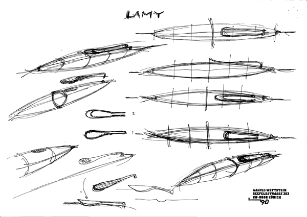
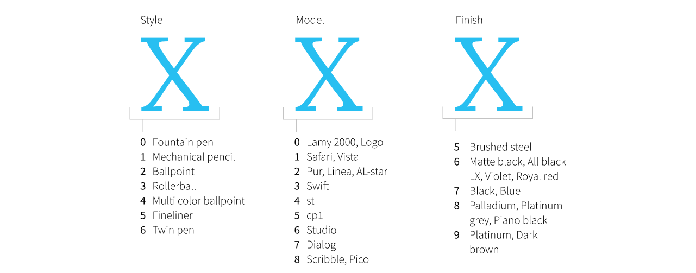

import PenCase from '../../components/PenCase.astro';
import { lamyStudio } from '../../data/pens';

In 2005 Lamy added a pen to its range that looks like nothing else in the catalogue: a slim, all-metal cigar with a clip shaped like the blade of a propeller. More than twenty years and a long list of colours later, the Lamy Studio is still for sale. This is its story, from the designer who drew it to every edition I could track down.

## At a glance

The Lamy Studio was introduced in 2005 as part of Lamy's premium range.[^lamy-wiki] It was designed by the Swiss designer Hannes Wettstein, and it won both a Good Design Award and an iF design award.[^awards] Like most Lamy families it comes as a fountain pen, rollerball and ballpoint. According to Lamy, every Studio is still assembled by hand at its workshop in Heidelberg.[^lamy-shop]

| Specification | |
|---|---|
| Designer | Hannes Wettstein |
| Introduced | 2005 |
| Body | All metal: brushed stainless steel, lacquered, or palladium or platinum coated |
| Clip | Solid steel, shaped like a propeller blade |
| Nib | Lamy Z50 steel, Z52 black steel (Lx All Black) or Z55 14k gold on the premium versions |
| Nib widths | EF, F, M, B, OM, OB |
| Filling system | Lamy T10 cartridge or Z27 converter |
| Length | About 140 mm capped, 153 mm posted |
| Weight | 24 to 31 g, depending on the finish |
| Model number | 06x (fountain pen), 26x (ballpoint), 36x (rollerball) |

The measurements come from Pen Boutique's overview of the range,[^penboutique] the nib widths and filling system from Lamy itself.[^lamy-shop]

## The designer: Hannes Wettstein

Hannes Wettstein was born on 10 March 1958 in Ascona, Switzerland. He trained as an architectural draughtsman, worked as an exhibition builder and started out as an independent designer in the early 1980s. His first breakthrough came in 1982 with Metro, a lighting system for Belux.[^wettstein-wiki] In 1991 he founded his own agency in Zürich.

Wettstein moved easily between scales. He designed chairs and sofas for Cassina and Molteni, interiors for the Grand Hyatt in Berlin and the Swiss embassy in Washington,[^wettstein-wiki] and watches for Ventura. For Ventura he combined a rectangular LCD with a round case, a shape that became known as the "Wettstein Knick" and turned the brand into a cult favourite.[^ventura] The <abbr title="Neue Zürcher Zeitung">NZZ</abbr> counted him among Switzerland's most important industrial designers.[^nzz]

Next to his practice he taught at the <a href="https://ethz.ch/">ETH in Zürich</a> from 1991 to 1996, and from 1994 to 2001 he was a professor at the <a href="https://hfg-karlsruhe.de/">Staatliche Hochschule für Gestaltung Karlsruhe</a> in Germany.[^wettstein-wiki]

Wettstein died on 5 July 2008 in Zürich, only three years after the Studio came out. His business partner Stephan Hürlemann continued <a href="http://www.hanneswettstein.ch/">the agency</a> as Studio Hannes Wettstein. In 2016 it was renamed <a href="https://www.huerlemann.com/">Hürlemann AG</a>.[^wettstein-wiki]

### Before the Studio: the Scribble

The Studio wasn't Wettstein's first pen for Lamy. That was the Scribble, a chunky mechanical pencil. The first computer designs and prototypes date from 1997, two more series of prototypes followed in 1998, and the final drawings were done in 1999: less than two years from first sketch to finished design.[^bleistift] Lamy introduced the Scribble in 2000.[^lamy-wiki]

The Scribble has a bulge in the middle of the barrel and flat faces that keep it from rolling off the table. It came as a 0.7 mm pencil and as a 3.15 mm lead holder, and a ballpoint was added later, almost as an afterthought. It won a Design Plus award in 2001 and an iF award in 2002.[^bleistift]

<figure>

<figcaption>Sketch of the Lamy Scribble © Agentur Hannes Wettstein, Zürich</figcaption>
</figure>

Look closely at this sketch and you could argue that Wettstein was already playing with the propeller-shaped clip that would end up on the Studio.

The collaboration clearly worked, because Lamy came back to Wettstein for a second design. This time not a single pencil, but a whole family: a fountain pen, a rollerball and a ballpoint.<ref>Was there a Studio twin pen (ballpoint and pencil) too? Check.</ref>

## The design

<ref>Add the scan of the design drawing from the book.</ref>

### Shape

The Studio is a slim cigar that tapers towards both ends. Lamy describes it as a "seamless barrel" with a "slightly curved, slim shape".[^lamy-shop] The whole pen, cap and barrel, is made of metal.

### The clip

The most eye-catching part of the pen, and probably the most thought-about, is the clip. It's a solid, polished piece of steel, twisted like the blade of an aeroplane propeller.[^penboutique] It is the same on every Studio, whatever the finish. The reviewer at The Pen Addict put it well: "Sometimes the simplest little feature grabs me and won't let go and with the Studio it is the clip."[^penaddict]

### The section

The launch models each came with a different section: black rubber on the Brushed Studio, polished steel on the Black, and a textured palladium finish on the Palladium. Most later editions use the polished steel section, which looks great but is slippery. The reviewer at The Pen Addict found it secure enough, though they "left plenty of fingerprints behind."[^penaddict] The rubber section returned on the Lx All Black in 2019.

### Nib and filling

The Studio uses Lamy's interchangeable steel nib, the same one found on the Safari and AL-star,[^gentleman-2019] so you can swap nib widths in seconds. The Lx All Black gets the black version of that nib. The premium versions (Palladium, Platinum, Piano Black and Piano Red) come with a 14k bicolour gold nib.[^penboutique] That gold nib has "some flex" to it, according to The Pen Addict, although their extra fine needed a trip to a nib specialist before it wrote the way it should.[^penaddict]

The fountain pen fills with Lamy T10 cartridges or a Z27 converter, and both come in the box.[^lamy-shop]

## The launch

Lamy dates the Studio to 2005, but it may have been on lamy.com as early as November 2004.[^archive-2004] <ref>Check the 2004 snapshot and look for a launch announcement or press release.</ref>

The launch line-up had three versions: Brushed (65), Black (67) and Palladium (68). What I find most interesting about this first release is that each of the three had a different section, as described above. The Palladium came with a 14k gold nib; all three were available in EF, F, M, B, OM and OB. In 2006, lamy.com still showed the same three: Palladium, Brushed and Black.

## Model numbers

Most Lamy pens follow the same numbering: three digits, each with its own meaning.

1. The first digit is the **type of pen**: 0 for a fountain pen, 1 for a mechanical pencil, 2 for a ballpoint and 3 for a rollerball.
2. The second digit is the **model**. The Lamy 2000 and the Logo share 0, the Safari and Vista have 1, the cp1 has 5 and the Studio has 6.
3. The third digit is the **finish**.

The leading zero of a fountain pen is usually dropped, which is why the Brushed Studio fountain pen is sold as the L65 rather than L065. The Brushed ballpoint and rollerball are the L265 and L365, and the Black rollerball is the L367.[^model-numbers]

<figure>

<figcaption>How Lamy's model numbers are built up</figcaption>
</figure>

So with these numbers you can identify a Lamy Studio Platinum ballpoint as model 269. <ref>Turn this into an illustration.</ref>

For the Studio, the finish digits work out roughly like this:

- **5**: brushed stainless steel
- **6**: a few special editions, like Rubin Black (2008) and Orion (2025)
- **7**: Black, Imperial Blue and most special editions up to 2020
- **8**: Palladium, Platinum Grey and the glossy Piano finishes with a gold nib
- **9**: Platinum, and most special editions since 2021

I'm under the impression that Lamy tries to align these finish numbers across models, but I'm not sure. There are discrepancies: on the cp1, 6 is the matt black finish, while the Studio uses 7 for black. <ref>Ask Lamy.</ref>

## The collection

Here is every Studio from the timetable below, in one case. On a computer or tablet they lie in a tray, one above the other: point at a pen to see its details next to it, or move through them with the arrow keys. On a phone they stand upright, and you swipe through them.

<ref>Replace the drawings with photos of my own pens, all framed the same way.</ref>

<PenCase pens={lamyStudio} label="Every Lamy Studio, 2005 to 2026" />

## Release timetable

Below is every Studio I could find. Special editions are marked as such. Where a special edition later joined the regular range, that's in the notes.

| Year | Name | Colour | Nib | Section | Finish | Model | Notes |
|---|---|---|---|---|---|---|---|
| 2005 | Brushed | Brushed steel grey | Steel | Black rubber | Brushed steel | 065 | Initial release |
| 2005 | Black | Black | Steel | Polished steel | Matt lacquer | 067 | Initial release[^black-067] |
| 2005 | Palladium | Beige palladium | Gold (14k) | Textured palladium | Matt palladium | 068 | Initial release |
| 2005 | Blue | Bright cobalt blue | Steel | Polished steel | Matt lacquer | 067<ref>check</ref> | Initial release according to Lamy,[^init-release] replaced by Imperial Blue in 2012 |
| 2007 | Pearl White | Sparkling white | Gold (14k) | Polished steel | Glossy white lacquer | 067 | Special edition[^pearl-white] |
| 2008 | Rubin Black | Brown (a mix of ruby and black) | Gold (14k) | Polished steel | Matt lacquer | 066 | Special edition |
| 2009 | Pearl Black | Sparkling glossy black | Gold (14k) | Polished steel | Glossy lacquer | Unknown | Special edition, Hong Kong only |
| 2009 | Violet | Purple | Gold (14k) | Polished steel | Matt lacquer | 067 | Special edition[^violet] |
| 2010 | Platinum Grey | Dark grey | Gold (14k) | Polished steel | Matt lacquer | 068 | Joined the regular range, gone from lamy.com by September 2015[^archive-2015] |
| 2011 | Platinum (Pt) | Polished silver | Gold (14k) | Polished steel | Polished platinum | 069 | Joined the regular range, still on lamy.com in September 2015[^archive-2015] |
| 2012 | Royal Red | Orange red | Steel | Polished steel | Matt lacquer | 067 | Special edition |
| 2012 | Imperial Blue | Dark navy blue | Steel | Polished steel | Matt lacquer | 067 | Regular range, replaced the bright blue[^imperial-blue] |
| 2014 | Wild Rubin | Deep red | Gold (14k) | Polished steel | Glossy lacquer | 067 | Special edition, also available with a steel nib |
| 2017 | Racing Green | Dark green | Steel | Polished steel | Matt lacquer | 067 | Special edition |
| 2017 | Piano Black | Deep black | Gold (14k) | Polished steel | Glossy lacquer | 068 | Regular range |
| 2018 | Olive | Green | Steel | Polished steel | Matt lacquer | 067 | Special edition |
| 2018 | Terracotta | Orange | Steel | Polished steel | Matt lacquer | 067 | Special edition |
| 2018 | Pearl Terracotta | Sparkling orange | Gold (14k) | Polished steel | Glossy lacquer | Unknown | Special edition, Hong Kong only |
| 2019 | Aquamarine | Turquoise | Steel | Polished steel | Matt lacquer | 067 | Special edition |
| 2019 | Lx All Black | Black | Black steel (PVD) | Black rubber | Matt lacquer | 067 | Special edition,[^gentleman-2019] later added to the regular range[^lamy-shop] |
| 2020 | Glacier | Light blue | Steel | Polished steel | Matt lacquer | 067 | Special edition |
| 2021 | Black Forest | Dark grey with a hint of green | Steel | Polished steel | Glossy lacquer | 069 | Special edition |
| 2022 | Dark Brown | Deep dark brown | Steel | Polished steel | Glossy lacquer | 069 | Special edition |
| 2023 | Rose (gloss) | Soft pastel pink | Gold (14k) | Polished steel | Glossy lacquer | 069 | Special edition, EU only |
| 2023 | Rose (matt) | Soft pastel pink | Steel | Polished steel | Matt lacquer | 069 | Special edition |
| 2024 | Piano Red | Vibrant blush red | Gold (14k) | Polished steel | Glossy lacquer | 068 | Regular range |
| 2024 | Royal Red | Soft dark red | Steel | Polished steel | Matt lacquer | 067 | Regular range |
| 2025 | Orion (matt) | Brownish purple red | Steel | Polished steel | Matt lacquer | 066 | Special edition[^lamy-shop] |
| 2026 | Petrol | Deep teal with a subtle shimmer | Steel | Polished steel | Matt lacquer | 069 | Special edition[^petrol] |

## The special editions

Lamy released its first Studio special edition in 2009, and has done so almost every year since 2017.[^goulet] A special edition isn't limited or numbered: it's simply made for a limited time and then disappears from the catalogue. Some colours later returned in the regular range: Royal Red, a special edition in 2012, came back in a darker shade in 2024.

In 2018 and 2019 Lamy even released two special editions a year: Olive and Terracotta, then Aquamarine and the Lx All Black. The Gentleman Stationer admitted to being puzzled by "two special editions in colors that don't seem to relate to one another."[^gentleman-2019]

A few editions were only sold in one region. The Pearl Black (2009) and Pearl Terracotta (2018) were Hong Kong exclusives with a gold nib and a glossy, sparkling lacquer,[^kmpn] and the glossy Rose from 2023 was only sold in Europe.

<ref>Add a photo of the Terracotta (Flickr, sentience) and ask for permission.</ref>

## The ballpoint redesign

At some point Lamy redesigned the Studio ballpoint. In the 2011 US catalogue the ballpoint still has its original short section, and it kept it until at least 2012.[^catalogue-2011] The Internet Archive shows how the change rolled out:

- **16 April 2014:** the Imperial Blue on lamy.com already has the new ballpoint, while Platinum Grey, Brushed, Palladium, Black and Platinum still show the old one.
- **18 September 2015:** only the Platinum still shows the old ballpoint. Platinum Grey is no longer in the range, which now consists of Black, Imperial Blue, Brushed, Palladium and Platinum.[^archive-2015]

So the new ballpoint appeared somewhere between 2012 and 2014 and, as far as I can tell, had replaced the old design across the range by 2015. <ref>What exactly changed? Add photos of the old and new ballpoint side by side.</ref>

## Questions for Studio Hannes Wettstein and Lamy

There's a lot I still don't know. These are the questions I'd love to ask the people who were there:

- When did the design process for the Studio start?
- What was Lamy's brief? Did Wettstein get carte blanche?
- What problem was Wettstein trying to solve with this design?
- What did the design process look like, and how many iterations and prototypes were made?
- What were the challenges in producing the pen?
- When exactly was the Studio first released?
- Why three different sections at launch: polished steel, rubber and textured palladium?
- Was Wettstein involved in later versions, like the Platinum, or in the ballpoint redesign?
- How did the ballpoint redesign come about?

## Words of gratitude

Throughout this article I've used several sources. Where I quote them directly, you'll find them in the footnotes. Some sources were so essential that a footnote doesn't do them justice.

<a href="https://bleistift.blog/2014/07/lamy-scribble/">Lamy Scribble</a> on Bleistift.blog helped a ton with the background of the Scribble. For more about Hannes Wettstein, read <a href="https://www.stylepark.com/en/news/remembering-hannes-wettstein">Remembering Hannes Wettstein</a> on Stylepark and his entry in the <a href="https://hls-dhs-dss.ch/de/articles/049370/2013-10-28/">Historisches Lexikon der Schweiz</a>.

[^lamy-wiki]: [Lamy (Unternehmen)](https://de.wikipedia.org/wiki/Lamy_(Unternehmen)) on Wikipedia lists the Studio as introduced in 2005 and the Scribble in 2000, both designed by Hannes Wettstein.
[^awards]: [Lamy](https://stationery.wiki/Lamy) on Stationery Wiki lists both awards for 2005; see also [iF Design: Lamy Studio](https://ifdesign.com/en/winner-ranking/project/lamy-studio/23768). <ref>2005 or 2006 for the iF award? And which Good Design Award: Japan (G Mark) or the Chicago Athenaeum?</ref>
[^lamy-shop]: [LAMY studio fountain pen](https://www.lamy.com/en-us/p/lamy-studio-fountain-pen), Lamy.
[^penboutique]: [Surprising Simplicity: LAMY's Studio Pen Collection](https://www.penboutique.com/blogs/blog/surprising-simplicity-lamys-studio-pen-collection), Pen Boutique.
[^wettstein-wiki]: [Hannes Wettstein](https://de.wikipedia.org/wiki/Hannes_Wettstein), Wikipedia.
[^ventura]: [Ventura: the avant-garde brand of Swiss watches](https://www.architonic.com/en/story/susanne-fritz-ventura-the-avant-garde-brand-of-swiss-watches/7000679), Architonic.
[^nzz]: [Suche nach den Archetypen von morgen](https://www.nzz.ch/suche_nach_den_archetypen_von_morgen-ld.497054), NZZ.
[^bleistift]: [Lamy Scribble](https://bleistift.blog/2014/07/lamy-scribble/), Bleistift.blog.
[^penaddict]: [Lamy Studio Fountain Pen Review](https://www.penaddict.com/blog/2014/2/10/lamy-studio-fountain-pen-review), The Pen Addict (2014).
[^gentleman-2019]: [A Recap of Lamy's 2019 Special and Limited Releases](https://www.gentlemanstationer.com/blog/2019/9/21/a-review-of-lamys-2019-special-and-limited-releases), The Gentleman Stationer.
[^archive-2004]: [lamy.com, November 2004](https://web.archive.org/web/20041112035205/http://www.lamy.com/), Internet Archive.
[^model-numbers]: Retailers sell the Studio as the [L67 (Black)](https://altmanluggage.com/products/lamy-studio-black-model-l67-fountain-pen), [L265 (Brushed ballpoint)](https://altmanluggage.com/products/lamy-pens-studio-265-ballpoint-pen-brushed-stainless-steel) and [L367 (Black rollerball)](https://www.amazon.com/Stadium-Ballpoint-Water-based-Matte-inches/dp/B000UTO12O).
[^black-067]: Retailers and [Stationery Wiki](https://stationery.wiki/Lamy) list the Black Studio as 067 (L67).
[^init-release]: According to Lamy the Blue was part of the initial release, but the [Internet Archive](https://web.archive.org/web/20050206014328/http://www.lamy.com/ "Internet Archive Lamy 2005") only shows the Palladium, Black and Brushed in 2005.
[^pearl-white]: [Lamy Studio Special Edition, Pearl White](https://www.peytonstreetpens.com/lamy-studio-fountain-pen-special-edition-pearl-white-extra-fine-14k-nib-mint-works-well.html), Peyton Street Pens.
[^violet]: [LAMY Studio Special Edition History](https://www.gouletpens.com/blogs/fountain-pen-blog/lamy-studio-special-edition-history), The Goulet Pen Company, dates the Violet to 2009. <ref>My earlier notes said 2010. Check.</ref>
[^archive-2015]: lamy.com snapshots of 16 April 2014 and 18 September 2015, Internet Archive. <ref>Add the exact snapshot links.</ref>
[^imperial-blue]: Sold as the [L67IB](https://www.amazon.com/Studio-Fountain-Imperial-Medium-L67IBM/dp/B0063T8IDS).
[^petrol]: [LAMY studio petrol, Special Edition 2026](https://missing-pen.com/en/products/lamy-studio-fountain-pen-petrol-special-edition-2026), missing-pen.com; the model number 069 comes from [OnlineMantra](https://www.onlinemantra.in/en-us/products/lamy-069-studio-petrol-ct-fountain-pen-special-edition).
[^goulet]: [LAMY Studio Special Edition History](https://www.gouletpens.com/blogs/fountain-pen-blog/lamy-studio-special-edition-history), The Goulet Pen Company.
[^kmpn]: [kmpn.blogspot.com](https://web.archive.org/web/20191129003221/https://kmpn.blogspot.com/) and its [Lamy posts](https://web.archive.org/web/20191129003221/http://kmpn.blogspot.com/search/label/Lamy), Internet Archive.
[^catalogue-2011]: [Lamy Catalogue US 2011](https://www.scribd.com/document/94065548/Lamy-Catalogue-US-2011), Scribd.
