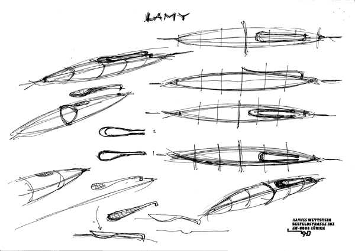
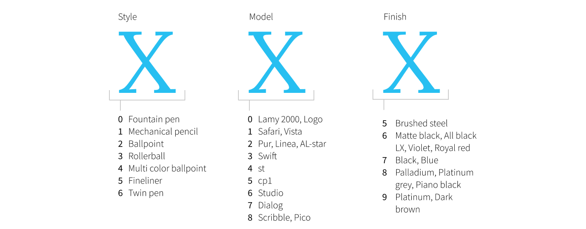

  
Information about the Lamy Studio

## Introduction
The Lamy Studio is a pen introduced in 2005 by Lamy and was placed in their premium product lineup. The pen was designed by renowed designer <a href="https://de.wikipedia.org/wiki/Hannes_Wettstein" title="Hannes Wettstein Wikipedia">Hannes Wettstein</a> and has since its introduction received several design awards. In 2005 the Good Design Award [ref needed] and in 2006 the iF award [^ref-a]. 

[^ref-a]: [iF Design - Lamy Studio](https://ifdesign.com/en/winner-ranking/project/lamy-studio/23768 "iF Design - Lamy Studio").

## About the designer
Hannes Wettstein, born 10 March 1958 in Ascona Switserland - died, 5th July 2008, was one of Switserlands most important industrial designers [^ref-c]. He founded <a href="http://www.hanneswettstein.ch/">his design agency</a> in 1991. This agency was led by Stephan Hürlemann under the same name untill 2016, upon wich it was changed to <a href="https://www.huerlemann.com/">Hürlemann AG</a>.

[^ref-c]: [Suche nach den Archetypen von morgen - NNZ](https://www.nzz.ch/suche_nach_den_archetypen_von_morgen-ld.497054 "Suche nach den Archetypen von morgen").

Next to his main job as a designer was also a teacher at the prestigious <a href="https://ethz.ch/">ETH in Zurich</a> from 1991 until 1996. From 1994 until 2001 he also was a professor at <a href="https://hfg-karlsruhe.de/">Staatlichen Hochschule für Gestaltung Karlsruhe</a>, Germany [^ref-b].

[^ref-b]: [Hannes Wettstein - Wikipedia](https://de.wikipedia.org/wiki/Hannes_Wettstein "Hannes Wettstein - Wiki").

https://www.stylepark.com/en/news/remembering-hannes-wettstein

### Scribble 
Wettstein's story with Lamy starts around 1997 with the initial sketches for the Scribble mechanical pencil. These sketches were followed up by several prototypes in 1998 and led to the final drawings in 1999 [^ref-d].

[^ref-d]: [Lamy Scribble - Bleistift Blog](https://bleistift.blog/2014/07/lamy-scribble/ "Lamy Scribble").

 In 2002 Lamy released the <em>Scribble</em> mechanical pencil <ref/>.

<figure>

<figcaption>
  Sketch of the Lamy Scribble &copy; Agentur Hannes Wettstein, Zürich

</figcaption>
</figure>

Looking at this sketch you might argue that Wettstein already hinted to a propeller shape clip which later would be used on the Lamy Studio.

https://hls-dhs-dss.ch/de/articles/049370/2013-10-28/

Apparently this process went well. Since he was asked to design another pen <ref>. This time not only limited to a pencil but a full suite of rollerball, ballpoint, twin pen (ballpoint and mechanical pencil combined) and fountain pen.

## About the design
.. scan van de tekening uit het boek .. 

- sigar shaped pen 
- tapers 

### The clip
One of the most thought about and eye catching elements of the pen is the propeller shaped clip. On all pens it is a glossy solid piece of metal that is attached on the cap of the pen. 

### The "slippery" section

### Reviews of the pen
https://www.penaddict.com/blog/2014/2/10/lamy-studio-fountain-pen-review

## The launch
... probeer iets te vinden van een product launch ... 
Probably 2004 November 2004 was hij op de site van Lamy
https://web.archive.org/web/20041112035205/http://www.lamy.com/

The initial launch of the Lamy Studio netted 3 versions of the Studio. The Palladium (model no. 68), Brushed steel (65) and Black (67). More about the model numbers below. But what I find the most interesting about this initial release is that the 3 models all have different sections. The Palladium has this textured finish on the section, the steel has the black rubberized section and the black has the polished section. I w

### Model numbers
Most Lamy pens follow the same modelnumber structure with 3 digits. Their position and number have a specific meaning. 

The first digit defines the <em>pen type</em> with 0 for fountain pen and 1 for mechanical pencil, 3 for ballpoint and so on. The second digit identifies the <em>pen model</em>. The Lamy 2000 for example is identified with a zero (0) as well as the Logo. The Safari and Vista are identified with 1, cp1 with 5 and Studio has 6. The last digit is for the <em>pen finish</em> and I am under the impression that Lamy tries to keep them similar across models but obviously these finishes are mostly unique to a specific model, in this case the Lamy Studio. Where the brushed steel is identified with a 5 and the Violet and Royal red (and I believe most special editions <ref>). 8 is used for the Palladium and Platinum grey. 

<figure>

<figcaption>
  Explanation of the Lamy pen model numbering

</figcaption>
</figure>

So with these numbers you could identify a Lamy Studio Platinum ballpoint with the 269 model number. The fountain pen model number (0) is not used so the Brushed steel Studio is just referenced to as 65 and not 065. 

<ref>Hier afbeelding van maken</ref>

I am under the impression that they try to align these finish numbers across models but I'm not really sure. I also see some discrepancies between finishes. The 6 for the cp1 model is the matte black finish but for the Studio they use the 7 for the black (and blue) finish. <ref>ask lamy</ref>. 

The Palladium was launched with a 14k nib. The pen was available with an EF, F, M, B, OM or OB nib. The black and brushed steel
Lamy.com
2006 had Palladium, Brushed en Black

Website van Lamy in 2005 toont de Palladium, Zwarte en Brushed variant (lijkt de initial releases)
https://web.archive.org/web/20050206014328/http://www.lamy.com/

https://www.fountainpennetwork.com/forum/topic/2950-lamy-studio-palladium-finish/#comment-25227

... waarschijnlijk brushed, zwart en blauw (checken of de palladium ook al bij de initial release was)

reference to black Studio in 2007: https://www.fountainpennetwork.com/forum/topic/41978-lamy-studio/
Also mentioned a brushed version in 2006 in the same article and a blue one at least in 2007
Also Palladium mentioned in 2007

Snapshot 15 mei 2006
https://web.archive.org/web/20060515191703/http://lamy.com/de/endverbraucher/produkte/schreibsysteme/fuellhalter?shownavi=true
- Palladium (highlighted)
- Black
- Brushed

Snapshot 9 december 2006
https://web.archive.org/web/20061209000527/http://www.lamy.com:80/en/endverbraucher/produkte/schreibsysteme/fuellhalter?shownavi=true
- Palladium
- Black
- Blue (Introductie!!! van Regular blue)
- Brushed

2007 checken
https://web.archive.org/web/20070210012254/http://www.lamy.com/en/endverbraucher/produkte/schreibsysteme/fuellhalter?shownavi=true
Snapshot 10 feb 2007
- Palladium
- Black
- Blue (INTRODUCTIE!, kan ook eind 2006 zijn geweest)
- Brushed (065)

Snapshot 16 mei 2008:
https://web.archive.org/web/20080516010002/http://www.lamy.com/products/writing_systems/fountain_pens/index_eng.html
- Regular (model number 065)
- Palladium (068)
- Blue (model number 067)
- Black (model number 067)
(november staat rubin Black erop dus intro moet in 2008 zijn geweest)

Snapshot 21 nov 2008
https://web.archive.org/web/20081121110531/http://www.lamy.com/produkte/schreibsysteme/fuellhalter/index_ger.html
- Regular (model number 065)
- Palladium (068)
- Blue (model number 067)
- Black (model number 067)
- Rubin Black (model number 066)

Snapshot 26 november 2011:
- Platinum Grey ("068 Platinum grey")
- Palladium ("068")
- Violet (266)
- Regular (67 blue)
- Black (67 Black)
- Brushed (ballpoint wordt Stahl genoemd) (065)
- Platinum (69)

Snapshot 14 october 2012
Zoals 2011 behalve:
- Geen violet
- Royal Red
- Geen regular blue maar Imperial Blue

Snapshot 13 nov 2012 had de Royal Red (Preis: 85.00 €)
https://web.archive.org/web/20121113111913/http://www.lamy.com/ger/b2c/studio/066_royalred

## Ballpoint redesign
Snapshot van 16 April 2014 heeft de Imperial Blue met het nieuwe design van de balpen. De Platinum grey, brushed, Palladium, Black en Platinum waren nog in het oude design van de balpen.

Aanname dat 2015 alles om is naar nieuw design. 
Snapshot van 18 september 2015 staat alleen de Platinum nog op de site met het oude bp design. 
Platinum Grey zit niet meer in het assortiment. Alleen Black, Imp Blue, Brushed, Palladium en Platinum

## The Special Editions
Introtekst voor special editions. Tijdelijke uitgave, niet gelimiteerd (en/of genummerd)

Ballpoint was still with the short section in 2012

2011 catalog: https://www.scribd.com/document/94065548/Lamy-Catalogue-US-2011

Present in the 2011 catalog:
- 65 (Brushed steel)
- 67 (Black and Blue)
- 68 (Palladium and Grey (SE), called: Platinum grey lacquer finish (US name))
- 69 (Platinum)

2011 had the old color blue. So the change happened in 2012. 

2011

2012 Had the new Imperial Blue version already. (not the old color)
2012 also had the Black and the Brushed finish

Lamy Studio

1. 2007 Pearl White (85 roller + 75 gold fp) check
2. 2008 Rubin Black (72 roller + 75 gold fp) check
3. 2009 Violet Purple (78 staal + 75 gold fp)
4. 2009 Platinum Grey (175 14k fountain)
5. 2009 Pearl Black (hongkong only)
6. 2010 Platinum Plated (216) Proof: https://web.archive.org/web/20191222172108/http://kmpn.blogspot.com/2010/
7. 2012 Royal Red 95 check
8. 2014 Wild Rubin 95 check
9. 2017 Racing Green 45 check
10. 2017 Piano Black (75) check (regular line up)
11. 2018 Olive Green (47) check
12. 2018 Terracotta (50)
13. 2018 Pearl Terracotta (hongkong only)
14. 2019 Aquamarine (60)
15. 2019 Black LX (90) (regular line up)
16. 2020 Glacier
16. Xxxx Imperial Blue (80 amazon) (regular line up)
17. Xxxx Blue (55 roller + 75 gold fp) (regular line up, discontinued in 2012)
18. Xxxx palladium (78 fountain, marktplaats)check  (regular line up)
19. Xxxx stainless brushed steel (48) check  (regular line up)
2021 Black Forest
2022 Dark Brown
2023 Rose (matte)
2024 Rose Glossy (EU only edition)

#### Terracotta 2018
https://web.archive.org/web/20191129003221/https://kmpn.blogspot.com/

https://web.archive.org/web/20191129003221/http://kmpn.blogspot.com/search/label/Lamy

Goeie:
https://web.archive.org/web/20191129003221/https://kmpn.blogspot.com/

Taken from: https://www.flickr.com/photos/sentience/46914143962/in/photolist-2etDfx5-osLjWB-2osRMkc-EBMrR9-bnm9HK-bnm8WB-bnm8qM-2osERjo-bnm7Tz-bnm8Dp-C7ebE-8KrMeg-Bi1kV-Bi1pb-Bi1nU-Bi1oF-8KrMmz-pyBP6P-bWMVQi-jkyrNC-bnm84K-bnm96X-2pjJrkB-FxnMQU-MPNw9m-bnm8MR-2oSRe8n-4ZhMAt-FzEuWM-Fxow2h-2gVsXKL-F88wxL-EC7aHD-FzEtpZ-ceaizQ-EC7cj4-FoZqTG-J9zazK-bnmaiT-Fxowj1-eSZwvU-Fxqhqq-EBKQEj-JVLbXG-2gjUS4Z-Fxovx1-6w3SNf-f2FYwy-f2rHup-bWMVsR

## Questions for Wettstein Studio and/or Lamy
- When did the initial design process start for the studio?
- What was the assignment from Lamy? Did Wettstein get a carte blanche from Lamy?
- What was the problem statement Wettstein used when coming up with a design for this pen?
- How did the design process look like?
- How many design iterations and/or prototypes were made?
- What were the challenges with the production of the pen?
- When was the initial release of the pen?
- What made Wettstein decide to have 3 types of sections 1 glossy chrome and 1 rubber/plastic (and later palladium)
- Was Wettstein involved in every evolvement of the pen (for example the platinum version)
- How did the redesign of the ballpoint come into being?

## Words of gratitude
Throughout this article I've used several sources, when directly cited, these are listed in the Footnotes, but some sources have been so essential that a simple footnote does not suffice to express my gratitude. These are listed below. 

<a href="https://bleistift.blog/2014/07/lamy-scribble/">Lamy Scribble</a> from Bleistift.blog. This has helped a ton for drafting the background on the Scribble pen. 

